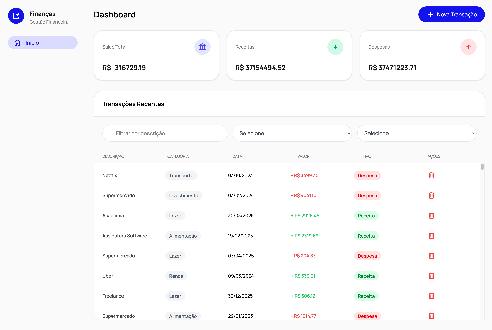
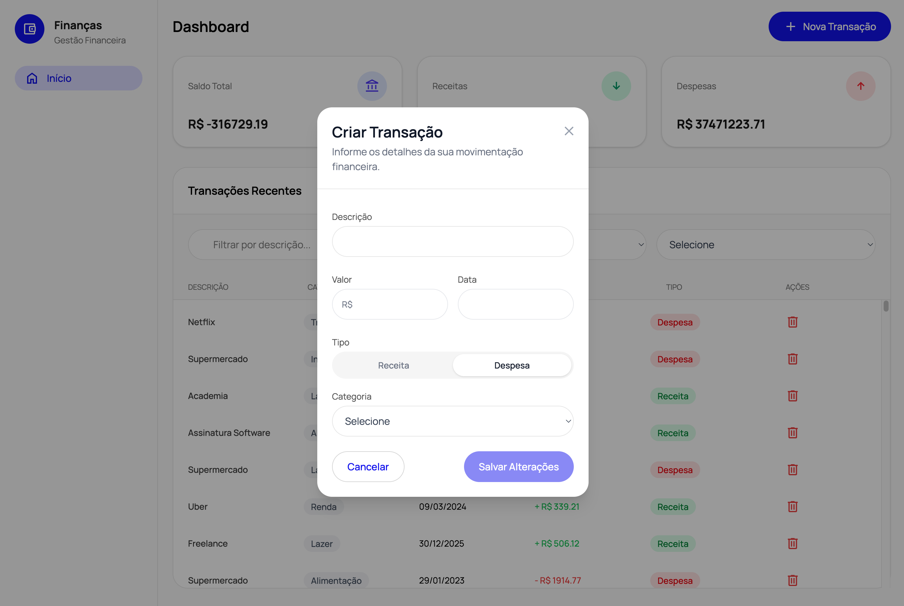

# desafio-f360

Gerenciador de Transações Financeiras

## Índice

- [Sobre o Projeto](#sobre-o-projeto)
- [Instalação](#instalacao)
- [Rodando o Projeto](#rodando-o-projeto)
- [Estrutura de Pastas](#estrutura-de-pastas)
- [Decisões Técnicas](#decisoes-tecnicas)
- [Screenshots](#screenshots)
- [Boas Práticas](#boas-praticas)
- [Estilização com Tailwind CSS](#estilizacao-com-tailwind-css)


## Sobre o Projeto

Aplicação para gerenciamento de transações financeiras, construída com Vue 3, Vite, TypeScript, Pinia e Tailwind CSS. O objetivo é demonstrar arquitetura escalável, boas práticas e código limpo.

## Instalação

Clone o repositório e instale as dependências:

```bash
git clone <url-do-repositorio>
cd desafio-f360
npm install
# ou yarn
```

## Rodando o Projeto

Para rodar em modo desenvolvimento:

```bash
npm run dev
# ou yarn dev
```

Para build de produção:

```bash
npm run build
# ou yarn build
```

## Estrutura de Pastas

```
src/
   components/      # Componentes Vue reutilizáveis
   layouts/         # Layouts globais
   views/           # Páginas principais
   stores/          # Estado global (Pinia)
   services/        # Serviços de API/lógica
   composables/     # Hooks reutilizáveis
   schemas/         # Schemas de validação (Zod)
   types/           # Tipos TypeScript globais
   utils/           # Funções utilitárias
   constants/       # Constantes globais
   mocks/           # Dados mockados
   assets/          # Imagens e assets estáticos
```

## Decisões Técnicas

- **Vue 3 + Vite + TypeScript**: Para performance, tipagem e DX moderna.
- **Pinia**: Gerenciamento de estado simples e escalável.
- **Tailwind CSS**: Rapidez e padronização visual.
- **Zod**: Validação de schemas de formulário.
- **Aliases de Imports**: Facilita manutenção e evita imports relativos longos.
- **Arquitetura Modular**: Separação clara de responsabilidades.
- **Barrel Files**: Facilita imports e refatoração.
- **Mocks**: Permite desenvolvimento sem backend.

## Screenshots

Adicione aqui prints da aplicação rodando:





